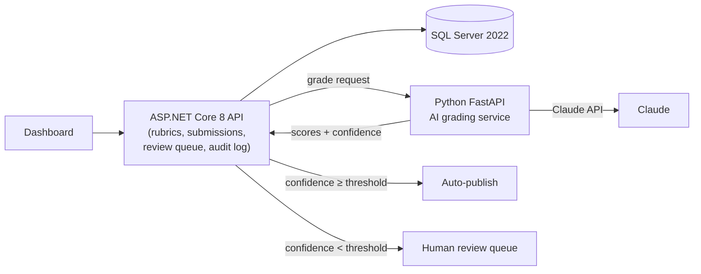

# GradeLens

**AI-assisted assessment & feedback engine with human-in-the-loop review.**

GradeLens grades free-text student answers against instructor-defined rubrics using an LLM — but treats the AI as an untrusted component. Every AI grade is validated against the rubric schema, scored for confidence, and either auto-published or routed to a human review queue. Every decision is written to an immutable audit trail.

> 🚧 Work in progress — Week 1 of the [roadmap](#roadmap) (core pipeline with stub grader) is complete.

## Why this project

Grading free-text answers at scale is slow, and naive "LLM grades it" solutions are unaccountable. GradeLens demonstrates the engineering that makes AI usable in a high-stakes workflow: structured-output validation, confidence-based routing, human overrides with mandatory reasons, and full auditability.

## Architecture



- **.NET API** owns business logic, data integrity, the grading state machine (`Pending → Grading → NeedsReview/Published/Failed`), and the audit log.
- **Python AI service** is an isolated, replaceable component: prompt assembly, Claude structured-output calls, self-consistency confidence scoring, embedding similarity.

## Getting started

Prereqs: [.NET 8 SDK](https://dotnet.microsoft.com/download/dotnet/8.0), Docker.

```bash
cp .env.example .env          # add your ANTHROPIC_API_KEY
docker compose up -d          # SQL Server + AI service
dotnet run --project src/GradeLens.Api
```

API docs at `http://localhost:5000/swagger` (port may vary — see console output).

Run tests:

```bash
dotnet test
```

## Roadmap

- [x] **Week 1** — Core pipeline: EF Core domain model, grading state machine, confidence routing, review queue, audit trail, stub grader
- [ ] **Week 2** — AI service: rubric-constrained Claude prompts with structured output, validation + retries, self-consistency confidence, embedding similarity
- [ ] **Week 3** — Human-in-the-loop polish + eval harness (gold dataset, LLM-vs-human agreement metrics per prompt version)
- [ ] **Week 4** — Dashboard, CI, demo GIF, v1.0

## Key design decisions

- **AI behind a service boundary** — the .NET core never trusts raw model output; the Python service is swappable (different model, local model) without touching business logic.
- **Explicit state machine** — illegal grade transitions throw; the audit trail always matches reality.
- **Confidence-based routing** — low-confidence grades go to humans, not students.
