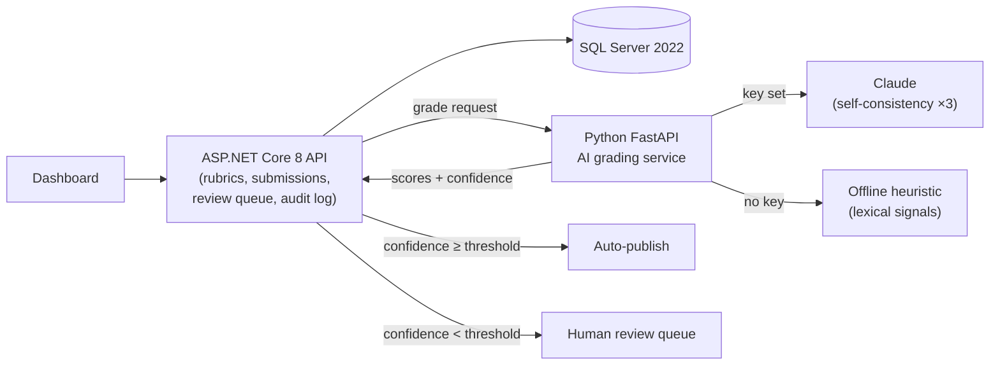

# GradeLens

**AI-assisted assessment & feedback engine with human-in-the-loop review.**

GradeLens grades free-text student answers against instructor-defined rubrics using an LLM — but treats the AI as an untrusted component. Every AI grade is validated against the rubric schema, scored for confidence, and either auto-published or routed to a human review queue. Every decision is written to an immutable audit trail.

## Why this project

Grading free-text answers at scale is slow, and naive "LLM grades it" solutions are unaccountable. GradeLens demonstrates the engineering that makes AI usable in a high-stakes workflow: structured-output validation, confidence-based routing, human overrides with mandatory reasons, and full auditability — with an eval harness measuring grader agreement against human scores.

## Architecture



- **.NET API** owns business logic, data integrity, the grading state machine (`Pending → Grading → NeedsReview/Published/Failed`), and the audit log. It re-validates every AI response against the rubric (range checks, complete coverage) — the AI side is never trusted.
- **Python AI service** is an isolated, replaceable component with two engines behind one contract:
  - **Claude grader** (when `ANTHROPIC_API_KEY` is set): rubric-constrained tool schema forcing structured JSON, schema validation with retry, self-consistency across 3 samples (median score, spread → confidence), blended with an independent lexical-similarity agreement signal.
  - **Offline heuristic grader** (default): deterministic lexical scoring — exemplar similarity + technical-vocabulary coverage, calibrated on the gold dataset. The whole system runs end-to-end **without any API key**.

## Getting started

Prereqs: [.NET 8 SDK](https://dotnet.microsoft.com/download/dotnet/8.0), Docker. No API key required.

```bash
cp .env.example .env                      # optionally add ANTHROPIC_API_KEY
docker compose up -d                      # SQL Server 2022 + AI grading service
dotnet run --project src/GradeLens.Api    # migrates + seeds automatically in Development
```

Open the dashboard at the URL shown in the console (e.g. `http://localhost:5080`) — grade the seeded submissions with one click and watch the confidence routing. Swagger UI at `/swagger`.

Run tests:

```bash
dotnet test                                          # .NET: state machine + pipeline
cd ai-service && python -m pytest && python eval/run_eval.py   # graders + eval
```

## Evals

The gold dataset (8 hand-graded answers) and the eval script live in [`ai-service/eval/`](ai-service/eval/). Iteration history in [docs/evals.md](docs/evals.md):

| Version | MAE (/20) | Within ±2 pts |
|---|---:|---:|
| heuristic-v1 | 7.62 | 12% |
| heuristic-v2 | 3.00 | 50% |

## Key design decisions

- **AI behind a service boundary** — the .NET core never trusts raw model output; the Python service is swappable (different model, offline mode) without touching business logic, and the contract is enforced on both sides.
- **Explicit state machine** — illegal grade transitions throw; the audit trail always matches reality.
- **Confidence = grader certainty, not answer quality** — confidence comes from agreement between independent signals (self-consistency spread + lexical agreement for Claude; signal agreement for the heuristic). Low-confidence grades go to humans, not students.
- **Offline-first** — the heuristic grader means demos, CI, and evals need no secrets; adding a key upgrades grading without any code change.

## Limitations & roadmap

- The offline heuristic is lexical — it rewards vocabulary, not correctness (see [docs/evals.md](docs/evals.md)); it exists as a baseline and no-key fallback.
- Grading is synchronous HTTP; a message queue (RabbitMQ) would decouple it for batch loads.
- Single demo course/rubric seeded; no auth yet — reviewer identity is caller-supplied.
- Next: measure the Claude grader on the gold set, held-out eval split, batch grading endpoint.
